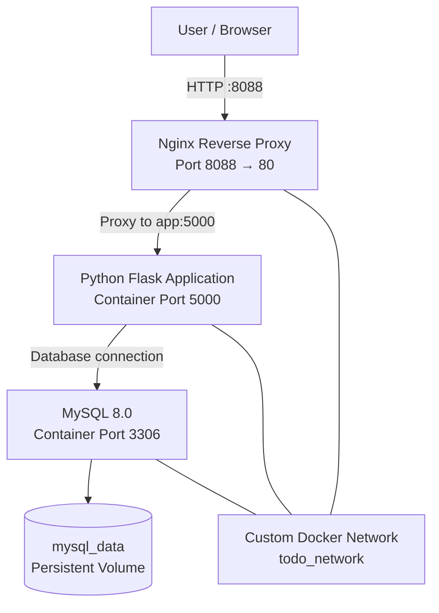
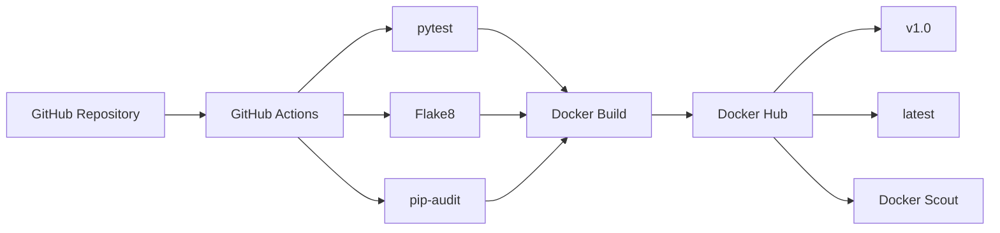

# Containerized Full-Stack To-Do Application

A production-oriented To-Do Management Application built with **Python Flask, MySQL, Docker, Docker Compose, Nginx, GitHub Actions, and Docker Hub**.

The project demonstrates containerization, multi-stage Docker builds, non-root execution, health checks, persistent storage, reverse proxy configuration, automated testing, code quality checks, dependency vulnerability scanning, and CI/CD automation.

---

## 1. Project Objective

The objective of this project is to design, develop, containerize, and automate deployment of a full-stack To-Do application using modern DevOps practices.

### Key objectives

* Build a Python Flask To-Do application
* Use MySQL as the database backend
* Containerize the application using Docker
* Use a multi-stage Dockerfile
* Run the application as a non-root user
* Implement application and database health checks
* Use environment variables for configuration
* Persist MySQL data using a Docker volume
* Use Docker Compose for multi-container orchestration
* Configure Nginx as a reverse proxy
* Use a custom Docker network
* Implement CI/CD using GitHub Actions
* Run automated unit tests
* Perform Flake8 code-quality checks
* Perform dependency vulnerability scanning with pip-audit
* Build and publish Docker images to Docker Hub
* Scan the Docker image using Docker Scout

---

## 2. Technology Stack

| Technology     | Purpose                             |
| -------------- | ----------------------------------- |
| Python 3.12    | Application runtime                 |
| Flask          | Web application framework           |
| MySQL 8.0      | Relational database                 |
| Docker         | Application containerization        |
| Docker Compose | Multi-container orchestration       |
| Nginx          | Reverse proxy                       |
| Git & GitHub   | Version control                     |
| GitHub Actions | CI/CD automation                    |
| pytest         | Unit testing                        |
| Flake8         | Code quality                        |
| pip-audit      | Python dependency security scanning |
| Docker Hub     | Container image registry            |
| Docker Scout   | Container vulnerability scanning    |

---

## 3. Architecture

The application uses three main containers:

1. **Nginx** – receives user requests and forwards them to Flask.
2. **Flask application** – handles To-Do application logic.
3. **MySQL** – stores application data.

MySQL data is stored in a persistent Docker volume so that database data survives container recreation.

### Architecture Diagram



### CI/CD Architecture



---

## 4. Application Flow

The application request flow is:

```text
User Browser
     |
     | HTTP :8088
     v
Nginx Reverse Proxy
     |
     | app:5000
     v
Python Flask Application
     |
     | MySQL :3306
     v
MySQL Database
     |
     v
mysql_data Persistent Volume
```

Nginx is the externally exposed web entry point.

The Flask application communicates with MySQL through the Docker network using the service name `mysql`.

---

## 5. Project Structure

```text
todo-app/
│
├── .github/
│   └── workflows/
│       └── ci-cd.yml
│
├── app/
│   ├── __init__.py
│   ├── app.py
│   ├── database.py
│   └── requirements.txt
│
├── mysql/
│   └── init.sql
│
├── nginx/
│   └── nginx.conf
│
├── tests/
│   └── test_app.py
│
├── Dockerfile
├── docker-compose.yml
├── .env
├── .gitignore
└── README.md
```

---

## 6. Docker Architecture

The application uses a **multi-stage Dockerfile**.

### Stage 1 – Builder

The builder stage:

* Uses Python 3.12 slim
* Creates a Python virtual environment
* Installs application dependencies
* Keeps dependency installation separate from the production image

### Stage 2 – Production

The production stage:

* Uses Python 3.12 slim
* Updates Debian security packages
* Copies the virtual environment from the builder
* Copies the application files
* Creates a dedicated `appuser`
* Runs the application as the non-root user
* Exposes port 5000
* Defines a container health check

This approach keeps the application image cleaner while separating dependency installation from the runtime environment.

---

## 7. Non-Root Container Execution

The Flask application does not run as root.

The Dockerfile creates:

```dockerfile
RUN useradd --create-home --shell /bin/bash appuser
```

and switches to:

```dockerfile
USER appuser
```

This reduces the security impact of a potential application compromise.

---

## 8. Health Checks

The project uses health checks to verify service availability.

### Flask health check

The Flask container checks:

```text
http://localhost:5000/health
```

The Dockerfile defines:

```dockerfile
HEALTHCHECK --interval=30s --timeout=5s --start-period=10s --retries=3
```

### MySQL health check

Docker Compose uses:

```text
mysqladmin ping
```

to verify that MySQL is ready.

### Dependency-based startup

The Flask application starts only after MySQL becomes healthy.

Nginx starts after the Flask application becomes healthy.

This creates the following dependency order:

```text
MySQL
  ↓
Healthy MySQL
  ↓
Flask Application
  ↓
Healthy Flask
  ↓
Nginx
```

---

## 9. Docker Compose

Docker Compose manages three services:

### App

```text
Service: app
Container: todo-app
Internal Port: 5000
Host Port: 5001
```

### MySQL

```text
Service: mysql
Container: todo-mysql
Image: mysql:8.0
Internal Port: 3306
```

### Nginx

```text
Service: nginx
Container: todo-nginx
Container Port: 80
Host Port: 8088
```

The normal application entry point is:

```text
http://localhost:8088
```

---

## 10. Custom Docker Network

All application services communicate through the custom Docker bridge network:

```text
todo_network
```

The network is defined as:

```yaml
networks:
  todo_network:
    driver: bridge
```

The services communicate using Docker service names instead of hard-coded container IP addresses.

For example:

```text
app → mysql:3306
nginx → app:5000
```

---

## 11. Persistent Database Storage

MySQL uses a named Docker volume:

```text
mysql_data
```

The volume is mounted at:

```text
/var/lib/mysql
```

This ensures that database data survives container recreation.

The initialization script is also mounted:

```text
./mysql/init.sql
→ /docker-entrypoint-initdb.d/init.sql
```

---

## 12. Environment Configuration

The application uses environment variables for database configuration.

Example configuration:

```text
MYSQL_DATABASE=todo_db
MYSQL_USER=todo_user
MYSQL_PASSWORD=<your-password>
MYSQL_ROOT_PASSWORD=<your-root-password>

DB_HOST=mysql
DB_PORT=3306

APP_PORT=5001
```

### Security note

The `.env` file contains database credentials and should **not be committed to GitHub**.

It should be included in `.gitignore`.

For production deployments, secrets should be managed using a dedicated secrets-management solution rather than storing credentials directly in source control.

---

## 13. Running the Application

### Clone the repository

```bash
git clone <repository-url>
cd todo-app
```

### Configure environment variables

Create a `.env` file containing the required database and application configuration.

### Build the containers

```bash
docker compose build
```

### Start the application

```bash
docker compose up -d
```

### Check running containers

```bash
docker compose ps
```

### View logs

```bash
docker compose logs
```

Or view an individual service:

```bash
docker compose logs app
docker compose logs mysql
docker compose logs nginx
```

### Access the application

Open:

```text
http://localhost:8088
```

---

## 14. Stopping the Application

To stop the containers:

```bash
docker compose down
```

To stop the containers while preserving the database volume:

```bash
docker compose down
```

The `mysql_data` named volume remains available unless it is explicitly removed.

---

## 15. Testing

Unit tests are implemented using `pytest`.

Run:

```bash
pytest
```

The test suite validates application functionality and helps prevent regressions.

---

## 16. Code Quality

The project uses **Flake8** for Python code-quality checks.

Run:

```bash
flake8 app
```

The same check is executed automatically by GitHub Actions.

---

## 17. Dependency Security Scanning

The project uses **pip-audit** to identify known vulnerabilities in Python dependencies.

Run:

```bash
pip-audit -r app/requirements.txt
```

This check is also executed automatically in the CI pipeline.

---

## 18. CI/CD Pipeline

GitHub Actions automatically runs the CI/CD workflow for:

* Pushes to `main`
* Pull requests targeting `main`

The workflow contains two jobs.

### Job 1 – Test

The test job:

1. Checks out the repository
2. Installs Python 3.12
3. Installs application dependencies
4. Runs pip-audit
5. Runs Flake8
6. Runs pytest

Pipeline:

```text
Checkout
   ↓
Python 3.12
   ↓
Install Dependencies
   ↓
pip-audit
   ↓
Flake8
   ↓
pytest
```

### Job 2 – Docker

The Docker job runs only after the test job succeeds.

This is controlled by:

```yaml
needs: test
```

The Docker job:

1. Checks out the repository
2. Logs into Docker Hub
3. Builds the Docker image
4. Creates the `v1.0` tag
5. Creates the `latest` tag
6. Pushes both tags to Docker Hub

Pipeline:

```text
Tests Pass
    ↓
Docker Build
    ↓
v1.0 + latest
    ↓
Docker Hub
```

---

## 19. Docker Image

The Docker image is published to Docker Hub as:

```text
poornimab03/todo-app
```

Available tags:

```text
v1.0
latest
```

Pull the image using:

```bash
docker pull poornimab03/todo-app:v1.0
```

or:

```bash
docker pull poornimab03/todo-app:latest
```

---

## 20. Docker Scout Security Scanning

Docker Scout is used to analyze the Docker image for known vulnerabilities.

The image can be inspected using:

```bash
docker scout cves poornimab03/todo-app:v1.0
```

Docker Scout helps identify vulnerable packages and provides information that can be used to improve image security.

---

## 21. Verification Commands

### Check containers

```bash
docker compose ps
```

### Check application health

```bash
docker inspect --format='{{json .State.Health}}' todo-app
```

### Check MySQL health

```bash
docker inspect --format='{{json .State.Health}}' todo-mysql
```

### Check Nginx logs

```bash
docker logs todo-nginx
```

### Check application logs

```bash
docker logs todo-app
```

### Check MySQL logs

```bash
docker logs todo-mysql
```

### Check network

```bash
docker network inspect todo-app_todo_network
```

### Check volumes

```bash
docker volume ls
```

---

## 22. Security Practices Implemented

The project includes several container and application security practices:

* Multi-stage Docker build
* Non-root application execution
* Debian package security updates
* Environment-based configuration
* Database credentials separated from application source code
* Dependency vulnerability scanning with pip-audit
* Docker image vulnerability scanning with Docker Scout
* Health checks
* Minimal Python slim base image
* Read-only Nginx configuration mount
* Custom Docker network
* Persistent database storage

---

## 23. Requirement Completion

| Requirement                               | Status |
| ----------------------------------------- | ------ |
| Python To-Do application                  | ✅      |
| MySQL database                            | ✅      |
| Dockerized application                    | ✅      |
| Multi-stage Dockerfile                    | ✅      |
| Non-root application                      | ✅      |
| Health check                              | ✅      |
| Environment configuration                 | ✅      |
| Persistent MySQL volume                   | ✅      |
| Docker Compose                            | ✅      |
| Nginx reverse proxy                       | ✅      |
| Custom Docker network                     | ✅      |
| GitHub Actions CI/CD                      | ✅      |
| Unit tests                                | ✅      |
| Flake8 code quality                       | ✅      |
| pip-audit dependency scan                 | ✅      |
| Docker image build                        | ✅      |
| Docker Hub push                           | ✅      |
| `v1.0` + `latest` tags                    | ✅      |
| Docker Scout vulnerability scan           | ✅      |
| Application/container health verification | ✅      |
| Comprehensive documentation               | ✅      |
| Architecture diagram                      | ✅      |

---

## 24. Project Outcome

This project demonstrates a complete containerized application workflow from source code to a published Docker image.

The final architecture combines:

```text
Python Flask
     +
MySQL
     +
Docker
     +
Docker Compose
     +
Nginx
     +
GitHub Actions
     +
Automated Testing
     +
Security Scanning
     +
Docker Hub
```

The project demonstrates practical DevOps concepts including containerization, networking, persistent storage, health monitoring, CI/CD automation, code quality, dependency security, image security, and production-oriented container practices.

---

## 25. Final Architecture Summary

```text
                    ┌─────────────────┐
                    │      USER       │
                    │    Browser      │
                    └────────┬────────┘
                             │
                         HTTP :8088
                             │
                             ▼
                    ┌─────────────────┐
                    │      NGINX      │
                    │ Reverse Proxy   │
                    └────────┬────────┘
                             │
                         app:5000
                             │
                             ▼
                    ┌─────────────────┐
                    │  FLASK APP      │
                    │ Python 3.12     │
                    │ Non-root user   │
                    └────────┬────────┘
                             │
                         mysql:3306
                             │
                             ▼
                    ┌─────────────────┐
                    │     MYSQL       │
                    │     8.0         │
                    └────────┬────────┘
                             │
                             ▼
                    ┌─────────────────┐
                    │   mysql_data    │
                    │ Persistent      │
                    │ Docker Volume   │
                    └─────────────────┘


              CI/CD
                │
                ▼
        ┌─────────────────┐
        │     GitHub      │
        └────────┬────────┘
                 │
                 ▼
        ┌─────────────────┐
        │ GitHub Actions  │
        └────────┬────────┘
                 │
       ┌─────────┼─────────┐
       ▼         ▼         ▼
    pytest    Flake8   pip-audit
       │         │         │
       └─────────┼─────────┘
                 ▼
        ┌─────────────────┐
        │   Docker Build  │
        └────────┬────────┘
                 │
                 ▼
        ┌─────────────────┐
        │   Docker Hub    │
        │                 │
        │ v1.0 / latest   │
        └────────┬────────┘
                 │
                 ▼
        ┌─────────────────┐
        │  Docker Scout   │
        │ Vulnerability   │
        │     Scan        │
        └─────────────────┘
```

**Project:** Containerized Full-Stack To-Do Application
**Stack:** Python + Flask + MySQL + Docker + Nginx + GitHub Actions
**Container Registry:** Docker Hub
